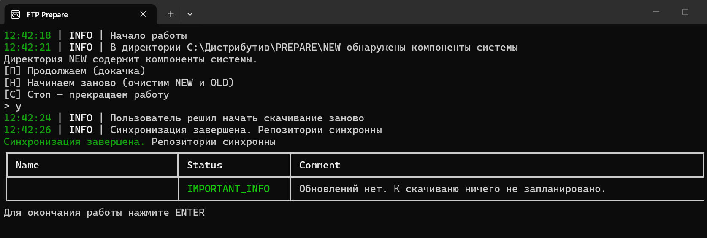
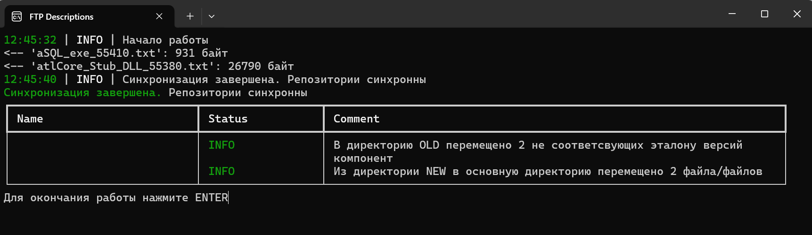

# FTP Galaxy 2

Набор Python CLI-инструментов для сопровождения файлового репозитория:

- `sync` синхронизирует локальное хранилище с FTP-сервером;
- `digest` разбирает текстовые описания обновлений и формирует Excel-отчёт.

Проект вырос из прикладной задачи автоматизации обновлений. Основной акцент сделан
на предсказуемой работе с файлами, восстановлении FTP-сессии, проверке результата
и изоляции бизнес-логики от инфраструктуры.

## Особенности

- При подключении через Ростелеком часть файлов FTP-сервера стабильно недоступна,
  тогда как через других проверенных операторов эти же файлы скачиваются. Для
  работы через Ростелеком их имена задаются в `stop_list`, который исключает
  недоступные файлы из плана загрузки. При запуске через другого оператора список
  можно отключить параметром `--mode no-list`; режим `--mode stop-list` включает
  его применение. 
  Итоговый отчёт копирования файлов явно указывает, какие файлы были исключены из
  синхронизации.
- Целостность скачанных файлов обязательно контролируется по размеру. В полном
  режиме дополнительно сравниваются локальная MD5-сумма и значение, полученное
  от FTP-сервера командой `XMD5`.
- Проверка MD5 опциональна. Если она включена, но FTP-сервер не предоставляет
  значение `XMD5` для конкретного файла, программа сообщает об этом и запрашивает
  решение пользователя о продолжении работы без MD5-проверки этого файла.
- Поддерживаются повторные попытки после сетевых ошибок и докачка частично
  загруженного файла с использованием FTP-команды `REST`.

## Демонстрация работы

Синхронизация уже актуального локального репозитория:



Загрузка двух обновлённых файлов с переносом прежних версий в каталог `OLD`:



## Что демонстрирует проект

- чистую архитектуру и явное внедрение зависимостей;
- контракты компонентов через `typing.Protocol`;
- конфигурацию через YAML и модели Pydantic;
- FTP-операции с повторными попытками и докачкой файлов;
- построение снимков локального и удалённого репозиториев;
- планирование различий, перенос файлов и валидацию результата;
- генерацию форматированного Excel-отчёта через OpenPyXL;
- модульные, интеграционные и сквозные тесты без обращения к реальному FTP.

## Технологии

Python 3.14, Pydantic 2, Loguru, Rich, PyYAML, OpenPyXL, pytest, setuptools.

## Архитектура

```text
CLI / main
    |
    v
Controller
    |
    +-- application services
    |     snapshot -> diff plan -> transfer -> validate -> save -> report
    |
    +-- ports / protocols
    |
    +-- adapters and infrastructure
          FTP, filesystem, configuration, logging
```

В репозитории находятся два независимых приложения и общий инфраструктурный код:

```text
src/
├── SYNC_APP/       # синхронизация FTP и локального репозитория
├── DIGEST_APP/     # подготовка Excel-дайджеста
└── GENERAL/        # конфигурация, логирование и общие ошибки
tests/
├── sync/
├── digest/
├── general/
└── e2e/
```

Подробности приведены в [ARCHITECTURE.md](ARCHITECTURE.md).

## Установка

Требуется Python 3.14.

```powershell
git clone <repository-url>
cd FTP_Galaxy2
python -m venv .venv
.venv\Scripts\Activate.ps1
python -m pip install --upgrade pip
python -m pip install -e ".[dev]"
```

## Быстрый старт

Создайте локальный YAML-файл на основе примеров из каталога `examples`.
Локальные конфигурации с суффиксом `.local.yaml` исключены из git.

Синхронизация:

```powershell
sync examples/config_sync.example.yaml --mode no-list
```

Доступные параметры:

```text
sync CONFIG [--once-per-day] [--mode stop-list|no-list]
```

Формирование дайджеста:

```powershell
digest examples/config_digest.example.yaml
```

Обе команды также можно запускать как Python-модули:

```powershell
python -m SYNC_APP.main examples/config_sync.example.yaml --mode no-list
python -m DIGEST_APP.main examples/config_digest.example.yaml
```

> Пример синхронизации содержит публичный anonymous FTP и тестовые локальные пути.
> Перед рабочим запуском проверьте `ftp_root`, `local_dir`, `new_dir` и `old_dir`.

## Конфигурация

Минимальная конфигурация синхронизации:

```yaml
local_dir: "./data/repository"
ftp_root: "/pub/example/"
```

Дополнительно настраиваются:

- список исключений и обязательных файлов;
- количество повторов, задержка и таймаут FTP;
- размер блока загрузки;
- каталоги `NEW` и `OLD`;
- консольное и файловое логирование.

Конфигурация дайджеста задаёт каталог описаний и параметры Excel-файла:

```yaml
local_dir: "./data/descriptions"
excel:
  excel_path: "./output/digest.xlsx"
```

## Тесты

```powershell
pytest
```

Тесты используют фейки и заглушки для FTP, файловой системы и пользовательского
ввода. Реальный сетевой доступ для запуска набора не требуется.

Проверка покрытия:

```powershell
coverage run -m pytest
coverage report -m
```

## Ключевые инженерные решения

- Контроллеры отвечают за сценарий, а не за детали FTP или файловой системы.
- Зависимости передаются явно и могут заменяться тестовыми реализациями.
- Загрузки поддерживают повторные попытки, продолжение с локального смещения и
  проверку результата по размеру и, когда сервер поддерживает `XMD5`, по MD5.
- Файлы сначала попадают в `NEW`, проверяются и только затем переносятся.
- Предыдущие версии сохраняются в `OLD`, а конфликтные действия требуют явного
  решения пользователя.
- Ошибки конфигурации, сети и локальных файлов преобразуются в предметные
  исключения и понятные коды завершения.

## Документация

- [ARCHITECTURE.md](ARCHITECTURE.md) — границы и слои системы;
- [CONTRIBUTING.md](CONTRIBUTING.md) — правила развития проекта;
- [STYLEGUIDE.md](STYLEGUIDE.md) — соглашения по коду и тестам.

## Ограничения

Текущая версия ориентирована на конкретный anonymous FTP-сервер и Windows-среду.
Пути и структура входных описаний зависят от прикладного сценария. Для переноса
на другой сервер потребуется расширить модель FTP-конфигурации.
